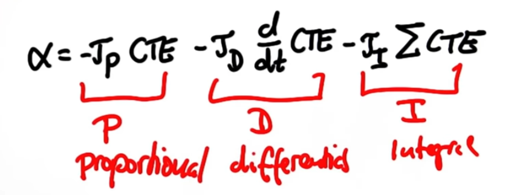

# PID Controller Project


## Background and Objectve

This is try to control sterring of a vehilce using PID controller. 
PID stands for (P: Propotional, I: Integral, D: Differential). The idea is to control vehicle/robot actuator (sterring for this case) in proportinal to following 3 inputs.

- Gap from the to-be route (Cross Tracking Error(CTE))  -- P 
- Differential of the Cross Tracking Error -- D
- Accumulative sum of the Cross Tracking Error -- I 

In short, the PID formula is as below: 


(source: Udacity)

Here alha is the target control. For this case, the angle of sterring. 
If the coefficient for each of P, I, D is set properly, the vehicle can run appropriately. 


## Approach

- The coefficients are esiamted by Twiddle approach. That is, iteratively adjusting the coefficients by seeing the change of the Cross Tracking Error, and differential and itntegral of that. 
- To make the iteration robust. Adjusted the coeffcients one by one, starting from P, then D, and I in the end. 

- As a result, following coeffcients are set for the PID controller. 
    - P  0.61
    - I: 00001
    - D: 1.20

- Throttle that controls the speed was fixed as a constant 


## Results 
- See the <a href ="/caputre.mp4"> video </a>
- The vehicle could run a course of in Virtual Environment (Unity) without going out of the course, for moderate speed (around 25 mph)
- However, still there are some spaces to improve, and especially this can be smoother. To do so, some smoothing filter can be applied. 


<br><br>
<hr>

## Dependencies

* cmake >= 3.5
 * All OSes: [click here for installation instructions](https://cmake.org/install/)
* make >= 4.1(mac, linux), 3.81(Windows)
  * Linux: make is installed by default on most Linux distros
  * Mac: [install Xcode command line tools to get make](https://developer.apple.com/xcode/features/)
  * Windows: [Click here for installation instructions](http://gnuwin32.sourceforge.net/packages/make.htm)
* gcc/g++ >= 5.4
  * Linux: gcc / g++ is installed by default on most Linux distros
  * Mac: same deal as make - [install Xcode command line tools]((https://developer.apple.com/xcode/features/)
  * Windows: recommend using [MinGW](http://www.mingw.org/)
* [uWebSockets](https://github.com/uWebSockets/uWebSockets)
  * Run either `./install-mac.sh` or `./install-ubuntu.sh`.
  * If you install from source, checkout to commit `e94b6e1`, i.e.
    ```
    git clone https://github.com/uWebSockets/uWebSockets 
    cd uWebSockets
    git checkout e94b6e1
    ```
    Some function signatures have changed in v0.14.x. See [this PR](https://github.com/udacity/CarND-MPC-Project/pull/3) for more details.
* Simulator. You can download these from the [project intro page](https://github.com/udacity/self-driving-car-sim/releases) in the classroom.

Fellow students have put together a guide to Windows set-up for the project [here](https://s3-us-west-1.amazonaws.com/udacity-selfdrivingcar/files/Kidnapped_Vehicle_Windows_Setup.pdf) if the environment you have set up for the Sensor Fusion projects does not work for this project. There's also an experimental patch for windows in this [PR](https://github.com/udacity/CarND-PID-Control-Project/pull/3).

## Basic Build Instructions

1. Clone this repo.
2. Make a build directory: `mkdir build && cd build`
3. Compile: `cmake .. && make`
4. Run it: `./pid`. 
